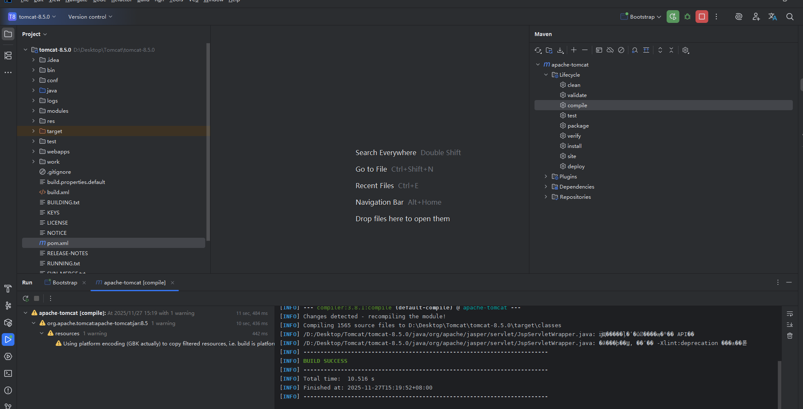
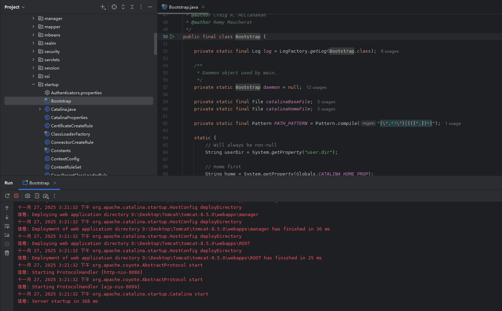
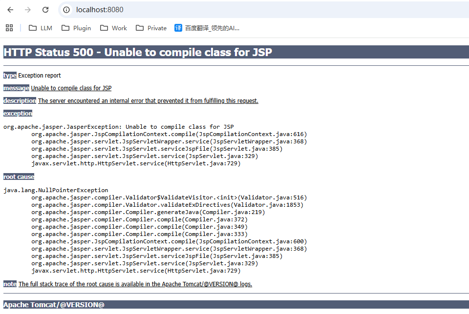
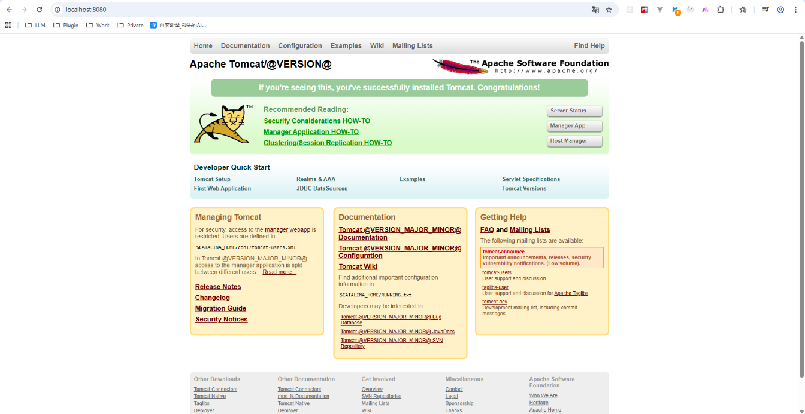

### 源码环境下载

以Tomcat 8.5版本为例

官网地址：https://github.com/apache/tomcat/tree/8.5.0

### Maven环境搭建

#### 2.1 环境准备

打开IEDA导入项目，然后在项目中创建一个新的pom.xml文件，里面的内容为：

```xml
<?xml version="1.0" encoding="UTF-8"?>
<project xmlns="http://maven.apache.org/POM/4.0.0"
         xmlns:xsi="http://www.w3.org/2001/XMLSchema-instance"
         xsi:schemaLocation="http://maven.apache.org/POM/4.0.0
            http://maven.apache.org/xsd/maven-4.0.0.xsd">
  <modelVersion>4.0.0</modelVersion>

  <groupId>org.apache.tomcat</groupId>
  <artifactId>apache-tomcat</artifactId>
  <version>8.5</version>

  <dependencies>
    <dependency>
      <groupId>org.apache.ant</groupId>
      <artifactId>ant</artifactId>
      <version>1.10.4</version>
    </dependency>
    <dependency>
      <groupId>wsdl4j</groupId>
      <artifactId>wsdl4j</artifactId>
      <version>1.6.2</version>
    </dependency>
    <dependency>
      <groupId>javax.xml</groupId>
      <artifactId>jaxrpc-api</artifactId>
      <version>1.1</version>
    </dependency>
    <dependency>
      <groupId>org.eclipse.jdt.core.compiler</groupId>
      <artifactId>ecj</artifactId>
      <version>4.5.1</version>
    </dependency>
    <dependency>
      <groupId>junit</groupId>
      <artifactId>junit</artifactId>
      <version>4.13</version>
    </dependency>
  </dependencies>

  <build>
    <finalName>apache-tomcat</finalName>
    <sourceDirectory>java</sourceDirectory>
    <resources>
      <resource>
        <directory>java</directory>
      </resource>
    </resources>
    <plugins>
      <plugin>
        <groupId>org.apache.maven.plugins</groupId>
        <artifactId>maven-compiler-plugin</artifactId>
        <version>3.8.1</version>
        <configuration>
          <source>1.8</source>
          <target>1.8</target>
          <encoding>UTF-8</encoding>
        </configuration>
      </plugin>
    </plugins>
  </build>
</project>
```

然后设置项目为Maven项目，选中pom.xml文件，鼠标右点。选择 `Add as Maven Project` .

在右侧出现的Maven菜单中选择编译项目(compile)



#### 2.2 项目启动

java/org/apache/catalina/startup/Bootstrap.java，main方法运行



#### 2.3 解决中文乱码问题

如果启动之后，控制台乱码，修改两处地方即可

修改org.apache.jasper.compiler.Localizer#getMessage(java.lang.String)方法

```java
    public static String getMessage(String errCode) {
        String errMsg = errCode;
        try {
            if (bundle != null) {
                errMsg = bundle.getString(errCode);
            }
        } catch (MissingResourceException e) {
        }
        try{
            errMsg = new String(errMsg.getBytes("ISO-8859-1"),"UTF-8");
        }catch (UnsupportedEncodingException e){
            e.printStackTrace();
        }
        return errMsg;
    }
```

修改org.apache.tomcat.util.res.StringManager#getString(java.lang.String)

```java
  public String getString(String key) {
        if (key == null){
            String msg = "key may not have a null value";
            throw new IllegalArgumentException(msg);
        }

        String str = null;

        try {
            // Avoid NPE if bundle is null and treat it like an MRE
            if (bundle != null) {
                str = bundle.getString(key);
                str = new String(str.getBytes("ISO-8859-1"), "UTF-8");
            }
        } catch (MissingResourceException mre) {
            //bad: shouldn't mask an exception the following way:
            //   str = "[cannot find message associated with key '" + key +
            //         "' due to " + mre + "]";
            //     because it hides the fact that the String was missing
            //     from the calling code.
            //good: could just throw the exception (or wrap it in another)
            //      but that would probably cause much havoc on existing
            //      code.
            //better: consistent with container pattern to
            //      simply return null.  Calling code can then do
            //      a null check.
            str = null;
        } catch (UnsupportedEncodingException e) {
            e.printStackTrace();
        }

        return str;
    }
```

#### 2.4 解决不支持JSP的问题

启动tomcat之后，访问localhost:8080之后，报错



原因是无法编译jsp。解决也很简单，按照下面步骤操作即可

上面的报错解决方式，可以在org.apache.catalina.startup.ContextConfig类中的configureStart方法中，添加一下JSP解析器初始化即可

```java
protected synchronized void configureStart() {
        // Called from StandardContext.start()

        if (log.isDebugEnabled()) {
            log.debug(sm.getString("contextConfig.start"));
        }

        if (log.isDebugEnabled()) {
            log.debug(sm.getString("contextConfig.xmlSettings",
                    context.getName(),
                    Boolean.valueOf(context.getXmlValidation()),
                    Boolean.valueOf(context.getXmlNamespaceAware())));
        }

        webConfig();
        context.addServletContainerInitializer(new JasperInitializer(), null);

        if (!context.getIgnoreAnnotations()) {
            applicationAnnotationsConfig();
        }
        if (ok) {
            validateSecurityRoles();
        }

        // Configure an authenticator if we need one
        if (ok) {
            authenticatorConfig();
        }

        // Dump the contents of this pipeline if requested
        if (log.isDebugEnabled()) {
            log.debug("Pipeline Configuration:");
            Pipeline pipeline = context.getPipeline();
            Valve valves[] = null;
            if (pipeline != null) {
                valves = pipeline.getValves();
            }
            if (valves != null) {
                for (int i = 0; i < valves.length; i++) {
                    log.debug("  " + valves[i].getClass().getName());
                }
            }
            log.debug("======================");
        }

        // Make our application available if no problems were encountered
        if (ok) {
            context.setConfigured(true);
        } else {
            log.error(sm.getString("contextConfig.unavailable"));
            context.setConfigured(false);
        }

    }
```

重启服务：访问搞定

